<div align="center">

# TLK ASCII

**Resim, video ve yazıdan parlayan ASCII sanatı. Ücretsiz, gizli, hesap gerektirmez.**

[**Uygulamayı aç ↗**](https://talkdedsec.github.io/tlk-ascii/) · [Windows için indir](https://github.com/Talkdedsec/tlk-ascii/releases/latest) · [English](README.md)

[](https://github.com/Talkdedsec/tlk-ascii/actions/workflows/ci.yml)
[](https://github.com/Talkdedsec/tlk-ascii/actions/workflows/pages.yml)
[](https://github.com/Talkdedsec/tlk-ascii/releases/latest)
[](LICENSE)

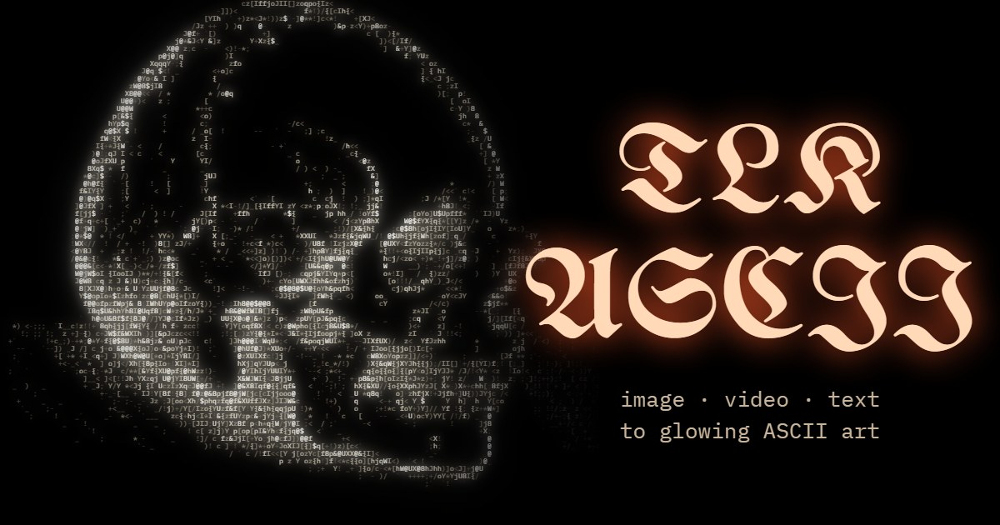

</div>

TLK ASCII; resimleri, videoları, GIF'leri, kamera görüntüsünü ve düz yazıyı parlayan ASCII sanatına çevirir. 26 hazır görünümden biriyle başla ya da kendininkini kur: üç çizim modu (ASCII, kenar çizgileri, yarım ton), dithering, 38 karakter seti (klasik rampalar, braille, bloklar, kart takımları, runlar, katakana…), 24 palet ve kendi paletin, parlama, CRT ekran bükülmesi, tarama çizgileri, film greni, gotik başlık ve hareket. Her formata göre kadrajla, orijinalle karşılaştır, her adımı geri al; sonra PNG, GIF, video, SVG, HTML veya metin olarak dışa aktar.

Her şey senin cihazında çalışır: GitHub Pages üzerinden tarayıcıda ya da internetsiz çalışan bir Windows programı olarak. Arayüz **Türkçe ve İngilizce**.

## Demolar

Her demo bir kaynak ve eksiksiz bir ayar seti yükler. Uygulamada açmak için birine tıkla.

| | | | | |
|:-:|:-:|:-:|:-:|:-:|
| [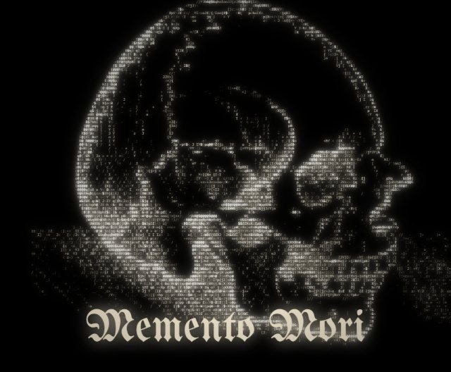](https://talkdedsec.github.io/tlk-ascii/#demo=skull)<br>Memento mori | [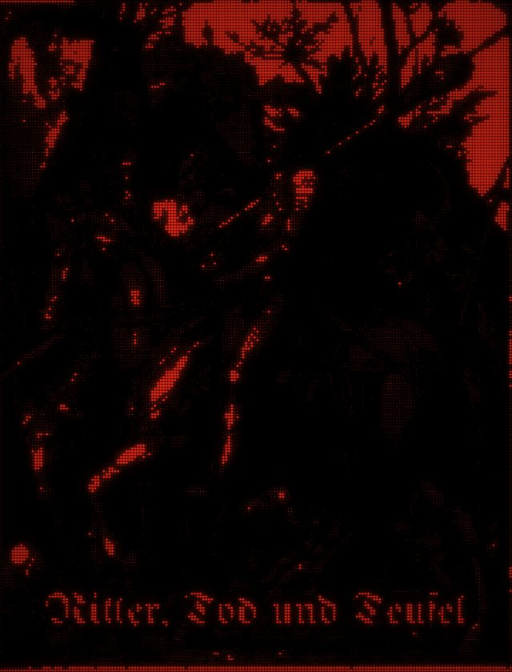](https://talkdedsec.github.io/tlk-ascii/#demo=knight)<br>Şövalye, Ölüm ve Şeytan | [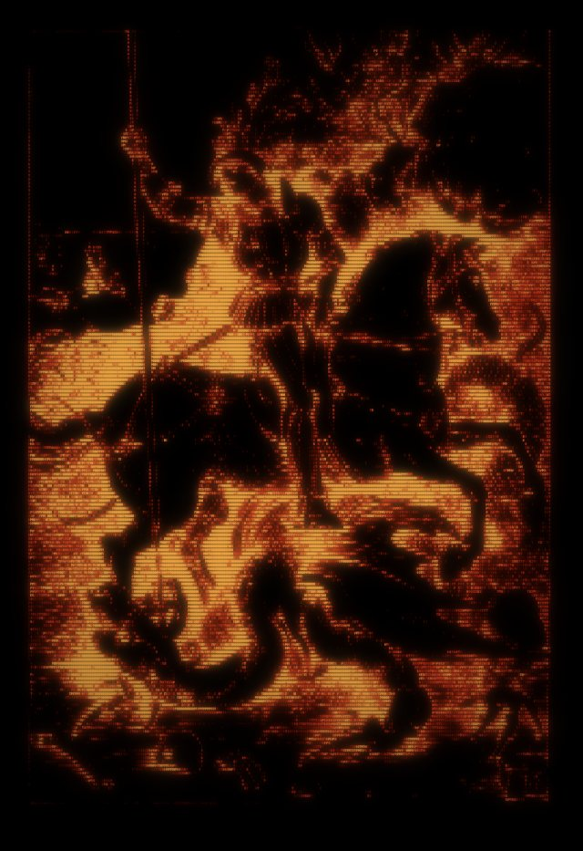](https://talkdedsec.github.io/tlk-ascii/#demo=dragon)<br>Ejderhanın runları | [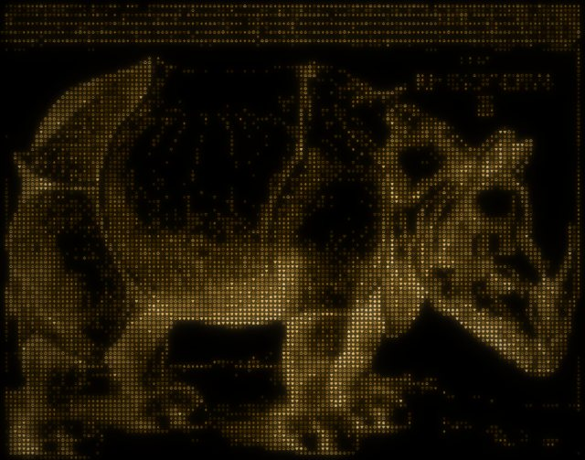](https://talkdedsec.github.io/tlk-ascii/#demo=rhino)<br>Yaldızlı gergedan | [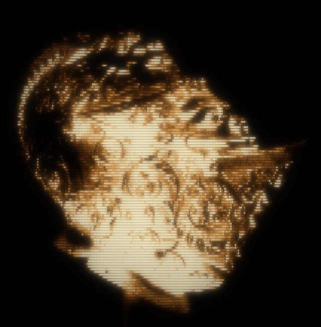](https://talkdedsec.github.io/tlk-ascii/#demo=helmet)<br>Dövme miğfer |
| [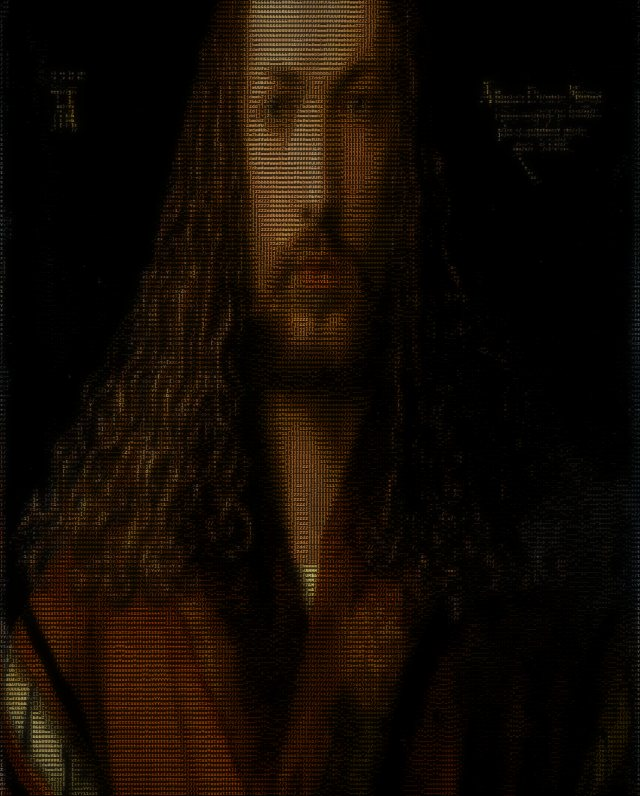](https://talkdedsec.github.io/tlk-ascii/#demo=portrait)<br>Renkli otoportre | [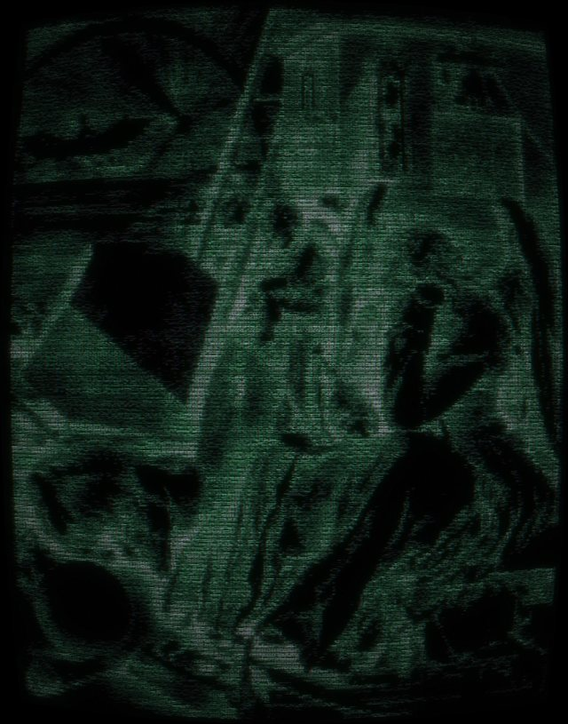](https://talkdedsec.github.io/tlk-ascii/#demo=melencolia)<br>Fosfor Melankoli | [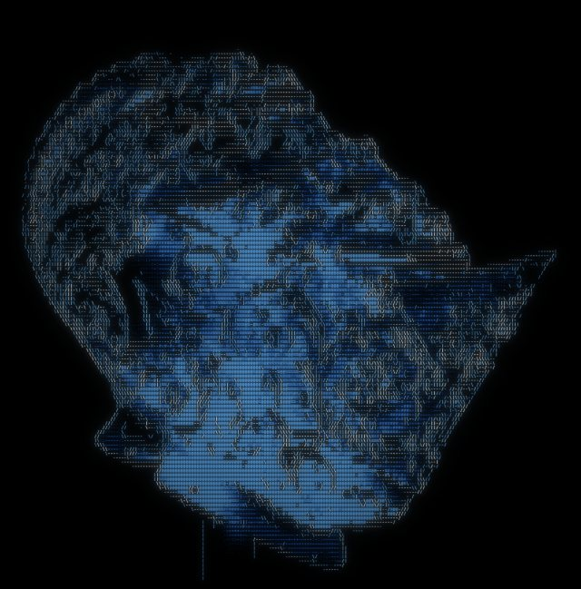](https://talkdedsec.github.io/tlk-ascii/#demo=sketch)<br>Çizgi eskiz (kenar) | [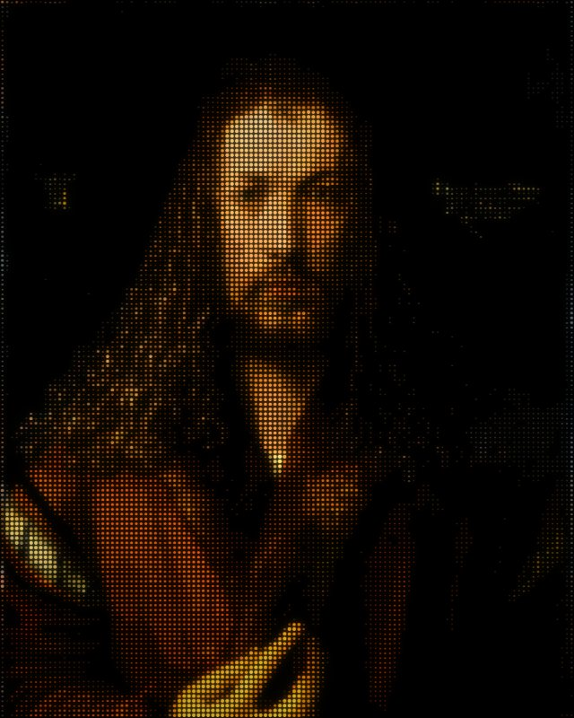](https://talkdedsec.github.io/tlk-ascii/#demo=halftone)<br>Renkli yarım ton | [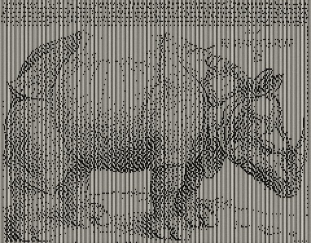](https://talkdedsec.github.io/tlk-ascii/#demo=bitmap)<br>Tek bit Atkinson |
| [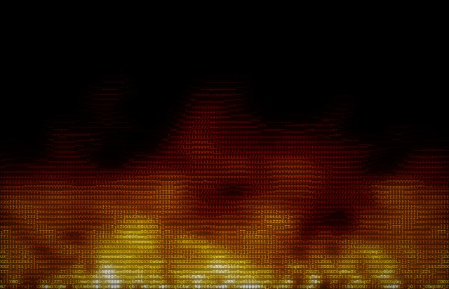](https://talkdedsec.github.io/tlk-ascii/#demo=fire)<br>Canlı ateş (hareketli) | [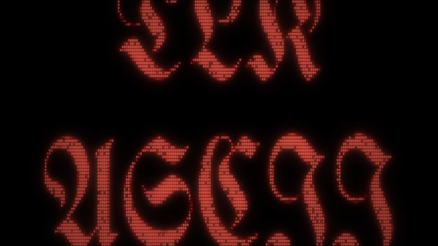](https://talkdedsec.github.io/tlk-ascii/#demo=gothic)<br>Gotik başlık | [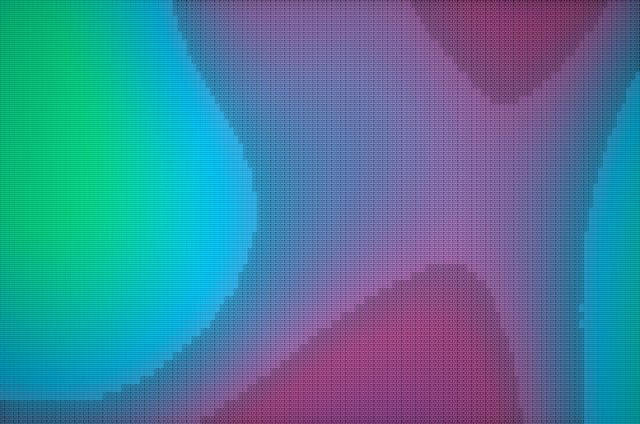](https://talkdedsec.github.io/tlk-ascii/#demo=plasma)<br>Buhar plazma (hareketli) |   |   |

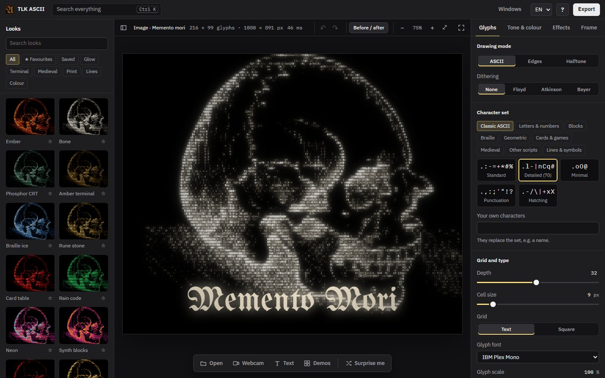

## 10 saniyede başla

1. [TLK ASCII'yi aç](https://talkdedsec.github.io/tlk-ascii/).
2. Sayfaya bir resim ya da video sürükle, <kbd>Ctrl</kbd>+<kbd>V</kbd> ile yapıştır veya **Demolar**'dan birini seç.
3. Soldaki galeriden bir görünüm seç, sağda ince ayar yap, sonra **Dışa aktar**'a bas.

Giriş yapmak, kurulum ya da dosya yüklemek gerekmez.

## Neler yapabilirsin

| Bölüm | Ayrıntı |
| --- | --- |
| Görünümler | Kendi resminle canlı önizlemeli 26 görünümlük galeri: arama, kategoriler, favoriler, kayıtlı ön ayarlar ve **Şaşırt beni** |
| Kaynaklar | Resimler (PNG, JPG, WebP, AVIF…), hareketli GIF/WebP, video dosyaları, kamera, yazı, üretilmiş ateş ve plazma |
| Çizim modları | Parlaklığa göre ASCII, **Kenar** (dış hatlar `\| / - \` ya da kutu çizgileriyle), **Yarım ton** (parlaklıkla büyüyen tek karakter) |
| Dithering | Çok az karakterle yumuşak tonlar için Floyd–Steinberg, Atkinson veya Bayer |
| Karakterler | 9 kategoride, görsel olarak seçilen 38 karakter seti; kendi karakterlerin (örneğin bir isim), 2–64 derinlik, hücre boyutu, metin veya kare ızgara, gotikler dahil 8 karakter fontu |
| Ton | Ters çevirme, parlaklık, kontrast, gama, kesme eşiği, doygunluk |
| Renk | 24 palet, 8 renge kadar palet editörü, tek renk ya da kaynaktan alınan renkler; tona göre solma; istediğin arka plan veya saydam |
| Efektler | İki aşamalı parlama, renk saçağı, tarama çizgileri, vinyet, film greni, CRT ekran bükülmesi |
| Başlık | Gotik ya da düz başlık; üstte net veya karakterlerden örülmüş |
| Hareket | Karakter döngüsü, titreme veya dalga; videolar ve GIF'ler canlı oynar |
| Kadraj | 1:1, 4:5, 9:16, 16:9, 3:2 ve 21:9 oranlar, yakınlaştırma, kaydırma (<kbd>Alt</kbd> + sürükle ile de), döndürme, aynalama |
| Düzenleme | Önce / sonra bölünmüş görünüm, geri al ve ileri al, etiketi sürükleyerek değer değiştirme, çift tıkla sıfırlama, video ve GIF için zaman çubuğu, odak modu |
| Komut paleti | <kbd>Ctrl</kbd>+<kbd>K</kbd> her işlemi, görünümü, demoyu ve paneli bulur |
| Dışa aktarma | İsteğe bağlı kırpmayla 1×–4× PNG, hareketli GIF, video (destekleniyorsa MP4, değilse WebM), SVG, HTML, TXT, pano |
| Paylaşım | Tüm ayarlarını taşıyan bir link; tarayıcıda ya da JSON olarak saklanan ön ayarlar |

Karakterler, seçilen fontta bıraktıkları mürekkep miktarına göre sıralanır. Bu sayede her set, senin yazdığın karakterler dahil, karanlıktan aydınlığa doğru eşlenir.

## Windows uygulaması

[Son sürümden](https://github.com/Talkdedsec/tlk-ascii/releases/latest) indir:

- `tlk-ascii-<sürüm>-portable.exe`: tek dosya, kurulum yok. Çift tıklayıp çalıştır.
- `tlk-ascii-<sürüm>-setup.exe`: geçerli kullanıcı için kurar; Başlat menüsü ve masaüstü kısayolu ile kaldırıcı ekler.

Web sitesiyle aynı uygulamadır ve tamamen internetsiz çalışır. Dosyalar kod imzalı değildir; Windows SmartScreen "Windows bilgisayarınızı korudu" diyebilir. **Ek bilgi → Yine de çalıştır**'ı seç ya da önce dosyayı sürümdeki `SHA256SUMS.txt` ile karşılaştır.

## İpuçları

- **Gravür ve çizgi resimler:** **Ters çevir**'i aç, kâğıt kaybolana kadar **Kesme eşiği**'ni yükselt.
- **Fotoğraflar:** karanlık resimlerde **Kaynak renkleri** ile 1,5–2 gama dene.
- **İsminden doku:** ismini **Kendi karakterlerin** alanına yaz (Karakter sekmesi).
- **Nereden başlayacağını bilmiyorsan:** birkaç kez <kbd>R</kbd>'ye bas, beğendiğine <kbd>Ctrl</kbd>+<kbd>Z</kbd> ile geri dön.
- **Sosyal medya paylaşımları:** Kadraj sekmesinden bir oran seç, sonra <kbd>Alt</kbd>'a basılı tutup resmi yerine sürükle.
- **Daha keskin ayrıntı:** hücre boyutunu düşür ya da çıktı genişliğini artır.
- **Bloklar ve braille** **Metin** ızgarasında hücreyi en iyi doldurur; **kart takımları ve noktalar** **Kare** ızgarada en iyi görünür.
- Herhangi bir kaydırıcıyı sıfırlamak için üstüne çift tıkla.

## Kısayollar

| Tuşlar | İşlem |
| --- | --- |
| <kbd>Ctrl</kbd> <kbd>O</kbd> | Dosya aç |
| <kbd>Ctrl</kbd> <kbd>S</kbd> | PNG kaydet |
| <kbd>Ctrl</kbd> <kbd>K</kbd> | Her işlemi, görünümü ve demoyu ara |
| <kbd>E</kbd> | Dışa aktar |
| <kbd>H</kbd> | Odak modu |
| <kbd>Ctrl</kbd> <kbd>Z</kbd> / <kbd>Ctrl</kbd> <kbd>Shift</kbd> <kbd>Z</kbd> | Geri al / ileri al |
| <kbd>C</kbd> | Önce / sonra |
| <kbd>R</kbd> | Şaşırt beni (rastgele görünüm) |
| <kbd>Alt</kbd> + sürükle, <kbd>Alt</kbd> + tekerlek | Resmi kadraj içinde kaydır ve yakınlaştır |
| <kbd>Ctrl</kbd> <kbd>Shift</kbd> <kbd>C</kbd> | Metin olarak kopyala |
| <kbd>Ctrl</kbd> + fare tekerleği | Görünümü yakınlaştır |
| <kbd>F</kbd> | Ekrana sığdır |
| <kbd>Boşluk</kbd> | Oynat / duraklat |
| <kbd>D</kbd> | Demolar |

## Gizlilik

Dosyalar tarayıcının File API'si ile okunur ve senin cihazında işlenir. Hiçbir şey yüklenmez; analiz aracı ve çerez yoktur. Kaydedilen ön ayarlar ve dil seçimi tarayıcının yerel depolamasında durur. Web sitesi GitHub Pages'te barındırılır; GitHub olağan erişim kayıtlarını tutabilir.

## Geliştirme

Node.js 24 yalnızca proje üzerinde çalışmak için gerekir; web uygulamasının derleme adımı yoktur.

```sh
git clone https://github.com/Talkdedsec/tlk-ascii.git
cd tlk-ascii
npm ci
npm run serve      # http://127.0.0.1:5173
npm test           # Edge veya Chrome'da uçtan uca testler
npm start          # masaüstü uygulaması
npm run dist       # release/ klasörüne Windows portable + kurulum
npm run demos      # demo önizlemelerini, ikonları, paylaşım görselini ve ekran görüntüsünü yeniden üret
```

```
web/        uygulama (HTML, CSS, düz JavaScript, fontlar, demo görselleri)
desktop/    web/ klasörünü internetsiz sunan Electron kabuğu
scripts/    yerel sunucu, tarayıcı testleri, demo üretici
```

Tarayıcı betikleri yüklü Edge veya Chrome'u kullanır; başka bir Chromium tabanlı tarayıcı için `BROWSER_PATH` ayarla.

## Emeği geçenler

Demo görselleri, hepsi kamu malı veya CC0:

- Andreas Vesalius, *De humani corporis fabrica*, 1543 ([Wikimedia Commons](https://commons.wikimedia.org/wiki/File:Vesalius_Fabrica_skulls.jpg))
- Albrecht Dürer, *Şövalye, Ölüm ve Şeytan*, 1513, National Gallery of Art ([Wikimedia Commons](https://commons.wikimedia.org/wiki/File:Albrecht_D%C3%BCrer,_Knight,_Death_and_Devil,_1513,_NGA_6637.jpg))
- Albrecht Dürer, *Ejderhayı Öldüren Aziz George*, 1501–1504, National Gallery of Art ([Wikimedia Commons](https://commons.wikimedia.org/wiki/File:Albrecht_D%C3%BCrer,_Saint_George_Killing_the_Dragon,_1501-1504,_NGA_6715.jpg))
- Albrecht Dürer, *Gergedan*, 1515, National Gallery of Art ([Wikimedia Commons](https://commons.wikimedia.org/wiki/File:Albrecht_D%C3%BCrer,_The_Rhinoceros,_1515,_NGA_47903.jpg))
- Albrecht Dürer, *Melencolia I*, 1514, National Gallery of Art ([Wikimedia Commons](https://commons.wikimedia.org/wiki/File:Albrecht_D%C3%BCrer,_Melencolia_I,_1514,_NGA_6640.jpg))
- Albrecht Dürer, *Yirmi Sekiz Yaşında Otoportre*, 1500 ([Wikimedia Commons](https://commons.wikimedia.org/wiki/File:Albrecht_D%C3%BCrer_-_1500_self-portrait_(High_resolution_and_detail).jpg))
- *Kapalı Miğfer*, y. 1555, The Metropolitan Museum of Art ([Wikimedia Commons](https://commons.wikimedia.org/wiki/File:Close_Helmet_MET_DT271729.jpg))

GIF kodlama: Matt DesLauriers'ın [gifenc](https://github.com/mattdesl/gifenc) kütüphanesi (MIT).

Fontlar, hepsi SIL Open Font License 1.1 altında (lisans metinleri [`web/fonts`](web/fonts) içinde): IBM Plex Sans, IBM Plex Mono, VT323, Press Start 2P, UnifrakturMaguntia, Pirata One, Grenze Gotisch, Jacquard 24, Noto Sans Runic ve Noto Sans Symbols 2'nin bir alt kümesi.

## Lisans

Kod [MIT](LICENSE) lisanslıdır. Fontlar kendi lisanslarını korur; demo görselleri kamu malı veya CC0'dır.
